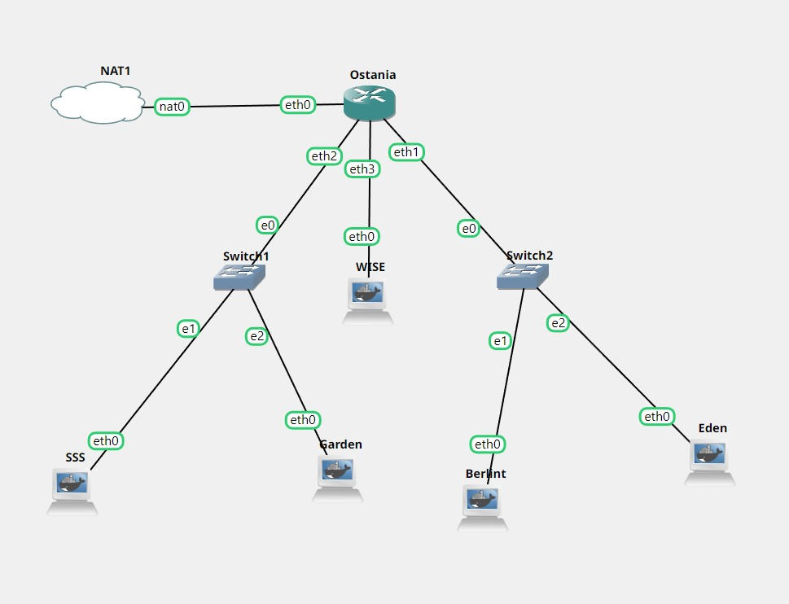

# Jarkom-Modul2-E14-2022

Lapres Praktikum Jarkom Modul 2

Dhafin Almas Nusantara - 5025201064

## Penjelasan

### **No 1**

**WISE akan dijadikan sebagai DNS Master**, **Berlint akan dijadikan DNS Slave**, dan **Eden akan digunakan sebagai Web Server**. **Terdapat 2 Client yaitu SSS, dan Garden**. Semua node terhubung pada router Ostania, sehingga dapat mengakses internet

**Topologi**


**Setting IP addres**

- Ostania

```
auto eth0
iface eth0 inet dhcp

auto eth1
iface eth1 inet static
	address 192.199.1.1
	netmask 255.255.255.0

auto eth2
iface eth2 inet static
	address 192.199.2.1
	netmask 255.255.255.0

auto eth3
iface eth3 inet static
	address 192.199.3.1
	netmask 255.255.255.0
```

- WISE

```
auto eth0
iface eth0 inet static
	address 192.199.3.2
	netmask 255.255.255.0
	gateway 192.199.3.1
```

- Berlint

```
auto eth0
iface eth0 inet static
	address 192.199.1.2
	netmask 255.255.255.0
	gateway 192.199.1.1
```

- Eden

```
auto eth0
iface eth0 inet static
	address 192.199.1.3
	netmask 255.255.255.0
	gateway 192.199.1.1
```

- Garden

```
auto eth0
iface eth0 inet static
	address 192.199.2.3
	netmask 255.255.255.0
	gateway 192.199.2.1
```

- SSS

```
auto eth0
iface eth0 inet static
	address 192.199.2.2
	netmask 255.255.255.0
	gateway 192.199.2.1
```

**Config Router (Ostania)**

Agar semua client yang dibawah ostania bisa terhubung ke internet, perlu menambahkan settingan iptbales. Kemudian simpan kedalam file `.bashrc`

```shell
iptables -t nat -A POSTROUTING -o eth0 -j MASQUERADE -s 192.192.0.0/16
echo "iptables -t nat -A POSTROUTING -o eth0 -j MASQUERADE -s 192.192.0.0/16
" >> .bashrc
```

**Config DNS Server (WISE & Berlint)**

install Bind9

```shell
apt update
apt install bind9 -y
```

**Config Web Server (Eden)**

install apache2,libapache,php dan aplikasi lainnya

```shell
apt update
apt install  apache2 -y
apt install  lynx -y
apt install  php -y
apt install wget -y
apt install unzip
apt-get install libapache2-mod-php7.0 -y
```

**Config Client (SSS & Garden)**

install Dnsutils dan lynx

```shell
apt update
apt install  lynx -y
apt install dnsutils
```

### **No 2**

Untuk mempermudah mendapatkan informasi mengenai misi dari Handler, bantulah Loid membuat website utama dengan akses wise.yyy.com dengan alias www.wise.yyy.com pada folder wise.

- **Config zone forwarder and revers WISE pada `/etc/bind/named.conf.local`**

```shell
zone "wise.E14.com" {
        type master;
        file "/etc/bind/jarkom/wise.E14.com";
};
zone "3.192.192.in-addr.arpa" {
        type master;
        file "/etc/bind/jarkom/3.199.192.in-addr.arpa";
};
```

- Kemudian buat folder wise di `/etc/bind` untuk menyimpan konfigurasi forward dan reverse

```shell
mkdir /etc/bind/jarkom
cp /etc/bind/db.local /etc/bind/jarkom/wise.E14.com
cp /etc/bind/db.local /etc/bind/jarkom/3.199.192.in-addr.arpa
```

- Konfigurasi forward dalam `/etc/bind/jarkom/wise.E14.com` , seprti konfigurasi dibawah

```shell
;
; BIND data file for local loopback interface
;
$TTL    604800
@       IN      SOA     wise.E14.com. root.wise.E14.com. (
                             2         ; Serial
                        604800         ; Refresh
                         86400         ; Retry
                       2419200         ; Expire
                        604800 )       ; Negative Cache TTL
;
@               IN      NS      wise.E14.com.
@               IN      A       192.199.1.3 // IP Eden
www             IN      CNAME   wise.E14.com.
```

### **No 3**

Setelah itu ia juga ingin membuat subdomain eden.wise.yyy.com dengan alias www.eden.wise.yyy.com yang diatur DNS-nya di WISE dan mengarah ke Eden.

- Kemudian Tambahkan konfigurasi subdomain pada file /etc/bind/jarkom/wise.E14.com

```shell
eden            IN      A       192.192.1.3 ; //IP Eden
www.eden        IN      CNAME   wise.E14.com.

```

### **No 4**

Buat juga reverse domain untuk domain utama

- Kemudian konfigurasi file reverse pada folder /etc/bind/jarkom/wise.E14.com

```shell
;
; BIND data file for local loopback interface
;
$TTL    604800
@       IN      SOA     wise.E14.com. root.wise.E14.com. (
                              2         ; Serial
                         604800         ; Refresh
                          86400         ; Retry
                        2419200         ; Expire
                         604800 )       ; Negative Cache TTL
;
1.199.192.in-addr.arpa. IN      NS      wise.E14.com.
3                       IN      PTR     wise.E14.com.
```

### **No 5**

Agar dapat tetap dihubungi jika server WISE bermasalah, buatlah juga Berlint sebagai DNS Slave untuk domain utama

- Tambahkan konfigurasi DNS master pada `/etc/bind/named.conf.local` di WISE

```shell
zone "wise.E14.com" {
        type master;
        notify yes;
        allow-transfer { 192.199.1.2; }; //IP Berlint
        also-notify { 192.199.1.2; }; //IP Berlint
        file "/etc/bind/wise/forward";
```

- Kemudian tambahkan konfigurasi DNS slave pada `/etc/bind/named.conf.local` di Berlint

```shell
zone "wise.E14.com" {
        type slave;
        masters { 192.192.3.2; }; // IP Wise
        file "/var/lib/bind/forward";
};
```

### **No 6**

Karena banyak informasi dari Handler, buatlah subdomain yang khusus untuk operation yaitu operation.wise.yyy.com dengan alias www.operation.wise.yyy.com yang didelegasikan dari WISE ke Berlint dengan IP menuju ke Eden dalam folder operation

- Pertama tambahkan beberapa konfigurasi pada file `/etc/bind/named.conf.options` di WISE dan Eden agar bisa melakukan delegasi subdomain.

```shell
options {
        directory "/var/cache/bind";
        allow-query{any;};
        auth-nxdomain no;    # conform to RFC1035
        listen-on-v6 { any; };
};
```

- Tambahkan konfigurasi pada `/etc/bind/jarkom/wise.E14.com`

```shell
ns1             IN      A       192.192.1.3
operation       IN      NS      ns1
```

- Kemudian tambahkan konfigurasi lagi pada /etc/bind/named.conf.local di Berlint.

```shell
zone "operation.wise.E14.com.in-addr.arpa" {
        type master;
        file "/etc/bind/operation/operation.wise.E14.com";
};
```

- Tambahkan juga konfigurasi pada `/etc/bind/operation/operation.wise.E14.com` di Berlint

```shell
;
; BIND data file for local loopback interface
;
$TTL    604800
@       IN      SOA     operation.wise.E14.com. root.operation.wise.E14.com. (
                              2         ; Serial
                         604800         ; Refresh
                          86400         ; Retry
                        2419200         ; Expire
                         604800 )       ; Negative Cache TTL
;
@       IN      NS      operation.wise.E14.com.
@       IN      A       192.199.1.3
www     IN      CNAME   operation.wise.E14.com.
```

### **No 7**

Untuk informasi yang lebih spesifik mengenai Operation Strix, buatlah subdomain melalui Berlint dengan akses strix.operation.wise.yyy.com dengan alias www.strix.operation.wise.yyy.com yang mengarah ke Eden

- Tambahkan konfigurasi pada `/etc/bind/operation` di Berlint

```shell
strix           IN      A       192.199.1.3
www.strix       IN      A       192.199.1.3

```

### **No 8**

Setelah melakukan konfigurasi server, maka dilakukan konfigurasi Webserver. Pertama dengan webserver www.wise.yyy.com. Pertama, Loid membutuhkan webserver dengan DocumentRoot pada /var/www/wise.yyy.com.

- download resource dan unzip sekaligus rename folder

```shell
wget --no-check-certificate 'https://drive.google.com/uc?export=download&id=1S0$

unzip /var/www/wise.zip -d /var/www
mv /var/www/wise /var/www/wise.E14.com
```

- Buat folder konfigurasi baru dengan mengcopy `000-default.conf`

```
cp /etc/apache2/sites-available/000-default.conf /etc/apache2/sites-available/wise.E14.com.conf
```

- Konfigurasi Apache pada direktori `/etc/apache2/sites-available/wise.E14.com.conf` di Eden.

```shell
<VirtualHost *:80>
        ServerAdmin webmaster@localhost
        DocumentRoot /var/www/wise.E14.com
        ServerName www.wise.E14.com
        ServerAlias www.wise.E14.com
        ErrorLog ${APACHE_LOG_DIR}/error.log
        CustomLog ${APACHE_LOG_DIR}/access.log combined
</VirtualHost>
```

### **No 9**

Setelah itu, Loid juga membutuhkan agar url www.wise.yyy.com/index.php/home dapat menjadi menjadi www.wise.yyy.com/home

- Tambahkan alias direktori pada `/etc/apache2/sites-available/wise.E14.com.conf`

```shell
   Alias "/home" "/var/www/wise.E14.com/index.php/home"
```

- Reload

```shell
a2ensite wise.E14.com
service apache2 reload
```

- Test web server

```shell
lynx wise.E14.com/home
```
